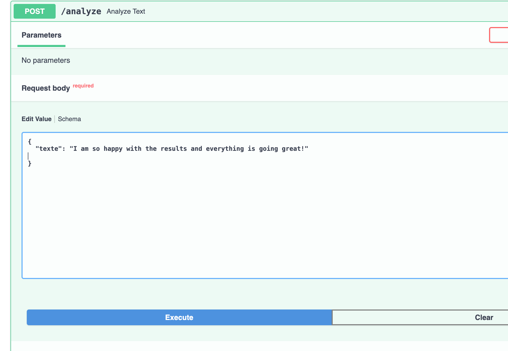

# ELK + MongoDB NLP Project

##   Project Purpose  
-   **Full pipeline:** Elasticsearch, Logstash, Kibana (ELK) + MongoDB ingestion + NLP enrichment + indexing to Elasticsearch + dashboard + simple API.  
-   **Dataset:** cyberbullying CSV (source: [Kaggle](https://www.kaggle.com/datasets/saifulislam7/cyberbullying-and-harassment-detection-using-ml))  
###   **Scripts and File Structure**

- **`scripts/preprocess.py`** — Cleans and prepares the raw dataset (`cyberbullying.csv`) to produce a structured output file:  
  → `data/cyberbullying_clean.csv`

- **`scripts/load_to_mongo.py`** — Imports the cleaned data into **MongoDB**, populating the collection:  
  → `harassment.posts`

- **`scripts/nlp_pipeline.py`** — Performs **language detection** and **sentiment analysis** using *VADER*.  
  Can process data from either **MongoDB** or standalone **CSV** files.

- **`scripts/mongo_to_es.py`** — Exports processed records from **MongoDB** to **Elasticsearch**, creating an indexed dataset for visualization and advanced search.

- **Docker configuration files**  
  - **`docker-compose.yml`** — Deploys a **secured ELK stack** *(Elasticsearch, Logstash, Kibana)* within a unified Docker network.  

  - **`Dockerfile.kibana`** — Builds a **custom Kibana image** featuring a personalized logo .

- **`screenshots/`** — Directory containing visual documentation of each major step in the workflow (referenced throughout the project).

##   Prerequisites

- macOS or Linux  
- Kaggle dataset downloaded and placed in `data/`  
- Docker & Docker Compose (v2): [Get Docker](https://docs.docker.com/get-docker/)  
- Python 3.8+ and pip  
- MongoDB running locally (or adjust `MONGO_URI`)  
- Elasticsearch and Kibana run via Docker Compose in this repo  

---

##   Install Python dependencies

```bash
python3 -m pip install --upgrade pip
python3 -m pip install pandas pymongo langdetect nltk elasticsearch[async]
# NLTK resource (vader) will be auto-downloaded by scripts, but you can also run:
python3 - <<PY
import nltk
nltk.download('vader_lexicon')
PY
```

##   Step 1: Setting Up ELK Environment

###   Dockerfile for Kibana with custom logo
```bash
FROM docker.elastic.co/kibana/kibana:7.17.9
COPY kibana_custom_logo/logo.png /usr/share/kibana/src/legacy/ui/public/assets/favicons/favicon.png
RUN rm -rf /usr/share/kibana/optimize/bundles

```
###   docker-compose.yml defines:

-  **Elasticsearch** with authentication (`xpack.security.enabled=true`)  
-  **Kibana** connected to Elasticsearch with credentials  
-  **Logstash** for data enrichment  

---

###   Start ELK stack
```bash
# macOS / Linux
docker compose up -d
```

###  Verify services

Check that all services are running correctly:

| Service         | Description            | URL |
|-----------------|------------------------|-----|
|  **Elasticsearch** | REST API endpoint for data indexing and search | [http://localhost:9200](http://localhost:9200) |
|  **Kibana**        | Web interface for data visualization and dashboards | [http://localhost:5601](http://localhost:5601) |


###   Screenshots

**Kibana authentication:**  


**Dashboard:**  


## Step 2 : Preprocess dataset (`data/preprocess.py`)

###    Place dataset
- Place `cyberbullying.csv` into `data/`  
- Source: [Kaggle Dataset](https://www.kaggle.com/datasets/saifulislam7/cyberbullying-and-harassment-detection-using-ml)

---

###   Run cleaning script
```bash
python3 scripts/preprocess.py

```
###   What it does (Preprocess script)
-   Robust path resolution (script-relative)  
-   Text cleaning (removes URLs, emails, extra whitespace)  
-   Normalizes `Label` and `Type`  
-   Generates `id_post` (stable integer)  
-   Deduplicates exact text duplicates  
-   Exports CSV (`data/cyberbullying_clean.csv`) and JSONL for import  

---

###   Load cleaned data into MongoDB (`scripts/load_to_mongo.py`)
- **Default DB/collection:** `harassment.posts` 

**Example run:**
```bash
# Ensure MongoDB is reachable; if using a different URI, set MONGO_URI env var
export MONGO_DB=harassment
python3 scripts/load_to_mongo.py --by id_post

```
###   Script behavior (Load to MongoDB)
- Loads `data/cyberbullying_clean.csv`  
- Deduplicates by `id_post` (removes exact duplicates in collection) and creates a unique index on `id_post`  
- Upserts documents with fields:  
  - `id_post`  
  - `texte`  
  - `Type`  
  - `Label`  

---

##   Step 3 : NLP Analysis Pipeline (`scripts/nlp_pipeline.py`)

###   Purpose
Detect language and compute sentiment using **VADER**. It can:  
- Process existing MongoDB documents and add:  
  - `language`  
  - `sentiment`  
  - `sentiment_scores`  
  - `sentiment_tokens`  
- Or process the CSV and optionally upsert results to MongoDB.

---

###   Run on MongoDB (default)
```bash
python3 scripts/nlp_pipeline.py
# Or force re-run for all documents:
python3 scripts/nlp_pipeline.py --force
# Process CSV and upsert:
python3 scripts/nlp_pipeline.py --source csv --upsert

```
**Screenshot:**  


##   Step 4 : Index to Elasticsearch (scripts/mongo_to_es.py)
- Ensure you target the DB that contains data (`harassment`) and correct ES credentials.
- Example:
```bash
export MONGO_DB=harassment
export ES_HOST="http://localhost:9200"
export ES_USER="elastic"
export ES_PASS="changeme123"
python3 scripts/mongo_to_es.py 
```
###   The script (`scripts/mongo_to_es.py`)
-  Detects common field names (`texte` / `text`) and normalizes mapping to expected Elasticsearch fields  
-  Creates index if missing  
-  Bulk indexes documents with `_id` set to `id_post` or original `_id`  
-  Index fields:  
  - `title` (if any)  
  - `text` (from `texte`)  
  - `language`  
  - `type`  
  - `label`  
  - `sentiment`  
  - `score` (compound)  
  - `id_post`  
  - `date`  
  - `source`  

---

###  Verify in Elasticsearch

**Count documents:**
```bash
# count:
curl -u elastic:changeme123 "http://localhost:9200/harassment_posts/_count"
# sample doc:
curl -u elastic:changeme123 "http://localhost:9200/harassment_posts/_search?size=1" -H 'Content-Type: application/json' -d '{"query":{"match_all":{}}}'
```

###   Screenshot: Verify Elasticsearch


##   Step 5: Dashboard in Kibana

###  Create an index pattern
- Match `harassment_posts`  

**Screenshot:**  


---

###   Build visualizations / dashboard
- Use the following fields:  
  - `language`  
  - `sentiment`  
  - `score`  
  - `Type`  
  - `Label`  
  - `id_post`  
  - `date`  
  - `source`  

**Screenshots of final dashboard:**  
- Sentiment distribution:  
  
- Language distribution:  
  

---

### Expose NLP via API (FastAPI example)

###   Run FastAPI app

```bash
# Run FastAPI app in scripts/app.py
uvicorn scripts.app:app --reload --host 0.0.0.0 --port 8000

# Then visit Swagger UI:
http://localhost:8000/docs

```
###  API Endpoints

The FastAPI app provides the following endpoints:  

- **POST** `/analyze` — Analyze a single text and return language & sentiment  
- **GET** `/status` — Return pipeline status  

###   Screenshots
- Test 1:  
   → Result:   
- Test 2:  
   → Result:   

---

##   File Map (Important Files)

| File | Description |
|------|-------------|
| `docker-compose.yml` | Services and networks |
| `Dockerfile.kibana` | Custom Kibana image (logo copy) |
| `data/cyberbullying.csv` | Original CSV (not committed) |
| `scripts/preprocess.py` | Cleaning script |
| `data/cyberbullying_clean.csv` | Output of preprocess |
| `scripts/load_to_mongo.py` | Loader into MongoDB |
| `scripts/nlp_pipeline.py` | NLP enrichment |
| `scripts/mongo_to_es.py` | Indexing to Elasticsearch |
| `scripts/app.py` | FastAPI endpoints |
| `screenshots/` | Images documenting each step |


##  Example Run (Quick Sequence)

```bash
# from project root
docker compose up -d         # start ELK (and other containers)
python3 data/preprocess.py   # produce data/cyberbullying_clean.csv
python3 scripts/load_to_mongo.py --by id_post
python3 scripts/nlp_pipeline.py
python3 scripts/mongo_to_es.py 
# open Kibana: http://localhost:5601 and create index pattern harassment_posts
```


